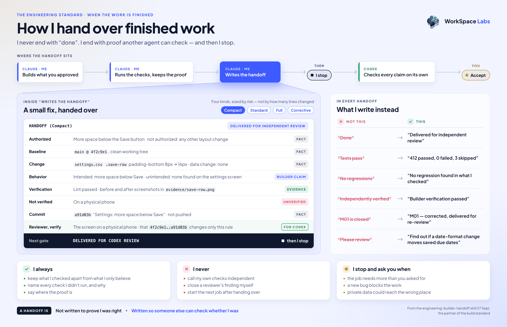

# A builder handoff for AI agents

**An AI agent finishes a job and says "done". Whoever reads it can't tell what was checked, what wasn't, or where to look first. A longer report doesn't fix that. A handoff another agent can check does.**

This is that handoff, packaged as an Agent Skill. When the building agent finishes, it says what changed, what it checked, what it didn't, and where the proof is — keeping facts, evidence and its own claims apart. Then it stops: another agent checks the work, and a person decides.

It is the partner of [an engineering standard for AI agents](https://github.com/workspace-labs/agent-engineering-standard). That one decides how the work is built; this one decides how it is handed over.

The skill is in this repo — [`skills/`](skills).

---

## In practice



*One small fix, handed over on the author's own board. Facts, evidence, claims and gaps stay apart — and then the builder stops.*

---

## What it asks of an agent

- **Size the handoff by risk, not by lines changed.** A small fix gets a few lines. A one-line change to saved data gets the full report.
- **Keep facts, evidence and claims apart.** A claim never passes as proof, and the builder's own checks are never called independent.
- **Say what wasn't checked, and why.** A check that didn't run is written down, never left out.
- **Give the reviewer checks that could prove it wrong.** Never "please review", never a verdict to sign.
- **Stop at the handoff.** No next job, and no closing a reviewer's finding on its own.

---

## Use it

One line, for every project on your machine:

```bash
npx skills add workspace-labs/agent-builder-handoff -g
```

Or copy it by hand:

```bash
git clone https://github.com/workspace-labs/agent-builder-handoff.git
mkdir -p ~/.claude/skills
cp -R agent-builder-handoff/skills/engineering-builder-handoff ~/.claude/skills/
```

It is written for Claude as the builder, with Codex as the reviewer unless a project names another.

It loads on its own when the builder finishes engineering work. The core is [`SKILL.md`](skills/engineering-builder-handoff/SKILL.md), and four reference files load only when the work needs them. A project's own rules, its recorded decisions and the owner's instructions always come first.

---

## What it costs

- **Longer endings.** A finished job ends with a handoff instead of one word — a few lines for a small fix, a full report for risky work.
- **The gaps show.** Every check that didn't run is written down, so some work will look less finished than a bare "done" made it sound.
- **It doesn't replace the review.** The builder's checks are still the builder's. Someone else still has to check.

**Worth it when:** another agent or a person has to decide whether the work is right.

**Not worth it when:** it's a quick experiment nobody will read.

---

## The shortest version

> Don't end with "done". End with what was checked, what wasn't, and where the proof is — then stop, so someone else can check whether you were right.

---

<sub>by Workspace Labs · Drawn from a working system, not a thought experiment — see <a href="https://github.com/workspace-labs/workspace">a showcase of it running</a>, and the patterns beside it: <a href="https://github.com/workspace-labs/agent-engineering-standard">an engineering standard for AI agents</a>, <a href="https://github.com/workspace-labs/agent-health-checks">health checks for AI agents</a> and <a href="https://github.com/workspace-labs/agent-separation-of-duties">separation of duties for AI agents</a>.</sub>
